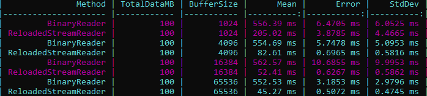
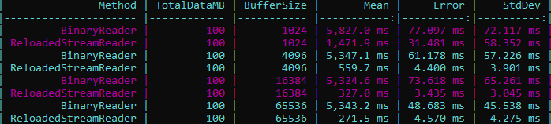
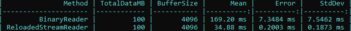

<div align="center">
	<h1>Reloaded.Memory: Getting Started</h1>
	
	<br/> <br/>
	<strong><i>By my arts, become hard as steel</i></strong>
</div>

## Page Information

🕒  Reading Time: 05-15 Minutes

## Introduction

The following is a small, quick, non-exhaustive resource to help you get started with the *Reloaded.Memory* library - providing an introduction to writing code using the library. This serves as a guide to help you get going, covering the basics and essentials.

## Pre-Prologue: Adding Reloaded.Memory to your project.
1.  Open/Create project in Visual Studio.
2.  Right-click your project within the `Solution Explorer` and select `Manage NuGet Packages`.
3.  Search for `Reloaded.Memory`.
4.  Install the package.

## Table of Contents
- [Prologue](#prologue)
- [Class Breakdown](#class-breakdown)
- [Performance Notes & Limitations](#performance-notes--limitations)
  * [ArrayPtr & FixedArrayPtr](#arrayptr--fixedarrayptr)
  * [BufferedStreamReader: Buffer Size](#bufferedstreamreader-buffer-size)
  * [BufferedStreamReader: Benchmarks](#bufferedstreamreader-benchmarks)
    + [FileStream](#filestream)
    + [MemoryStream](#memorystream)

## Prologue
Project-Reloaded exposes an interface named `IMemory` that can be used to perform memory manipulation actions.

The interface `IMemory` specifically is an interface designed to provide enhanced read/write access to *arbitrary memory*; "arbitrary memory" simply meaning *based on implementation*.

The two main implementations of `IMemory` in `Reloaded.Memory` are:
+ **Memory**: Provides Read/Write access to the memory of the current process.
+ **ExternalMemory**: Provides Read/Write access to the memory of another process.

Gaining access to memory of the current, or another process is as simple as creating an instance of either class.

```csharp
// Another process
Process helloWorldProcess = Process.Start("HelloWorld.exe");
IMemory externalMemory = new ExternalMemory(helloWorldProcess);

// Current process
IMemory externalMemory = new Memory();
```

Of course, you can create your own custom implementations of `IMemory`.
Additional functionality such as reading/writing arrays is available in the extension method `	MemoryExtensions` so make sure to include `using Reloaded.Memory.Sources`.

tl;dr: `IMemory` is an interface that allows you to read from a memory source, e.g. `Memory` for current process, `ExternalMemory` for another process.

## Class Breakdown
The following is a quick breakdown of the main classes you will probably find useful within the `Reloaded.Memory` library:

+ **ArrayPtr**: Pointer to an array in arbitrary memory.
+ **RefArrayPtr**: Version of `ArrayPtr` that returns elements by reference.
+ **FixedArrayPtr**: Pointer to an array with known length in arbitrary memory. (Allows for LINQ, foreach etc.)
+ **RefFixedArrayPtr:** A `RefArrayPtr` with known length exposing additional functionality such as copy to, copy from etc.
+ **Pointer**: Managed abstraction to a pointer in arbitrary memory.
+ **RefPointer:** Managed abstraction to a pointer in arbitrary memory that returns the pointed value by reference.

All of these use the `IMemory` interface under the hood, which can be manually set.
This means that you can e.g. have a pointer to a variable in another process.

*In addition, the following helper and utility classes are available:*

+ **Endian**: Utility method for swapping the endian of a specific variable.
+ **Struct**: Allows converting structs to bytes, converting bytes to structs, getting size of structs, writing struct to pointer etc.
+ **StructArray**: Array support for the `Struct` utility class. (The functions in `Struct`, but with arrays)
+ **CircularBuffer**: A stream-like buffer where once you reach the end of the buffer, it loops back over to the beginning.
+ **BufferedStreamReader**: A custom unsafe BinaryReader operating over `Stream` classes tuned for performance supporting generics (structs), marshalling and buffering.
+ **ExtendedMemoryStream**: An extension class for MemoryStream that supports appending of generic types as well as padding the stream.
+ **Pinnable<T>**: Class that allows for the pinning of unmanaged blittable types in memory for interop with unmanaged code.
+ **PinnableDisposable<T>:** A `Pinnable` that automatically disposes the pinned object when disposed.

Pretty much this is all you need to know.

Play around with the classes yourself and discover what you can do. Everything below is extra.

## Performance Notes & Limitations

### ArrayPtr & FixedArrayPtr
**ArrayPtr** and **FixedArrayPtr** offer both an indexer `[]` and `Get` + `Set` methods for reading and/or writing data. Due to reduced copying, the `Get` + `Set` methods are technically faster than the indexer in performance by a miniscule margin.

### Struct Methods
Micro-optimization: The `ToPtr` and `FromPtr` method sets from `Reloaded.Memory.Struct` are provided as convenience only. To squeeze maximum performance, consider using implementations of `IMemory` instead.

### Marshalling Overloads
Micro-optimization: If you are working with unmanaged structures or types, the overloads without `marshalElement` (whether to marshal the element) will perform better.

### BufferedStreamReader: Buffer Size
Benchmarking suggests the optimal buffer size for `BufferedStreamReader` to be 65536 for reading from an underlying `FileStream` and 512-2048 for `MemoryStream`.

Note: `Read<T>(out T)` can only be used to read structs smaller than the buffer size.

### BufferedStreamReader: Benchmarks
Tested on 9th of June 2019 using an Intel i7 4790k @ 4.5GHz and Crucial MX300 750GB SSD.

`BufferedStreamReader` is presented as `ReloadedStreamReader` for easier readibility.

#### FileStream
**100MB of Integers (4 bytes)**


**100MB of Small Structs (8 bytes)**


**100MB of Medium Structs (32 bytes)**


#### MemoryStream
**100MB of Integers (4 bytes)**


**100MB of Small Structs (8 bytes)**


**100MB of Medium Structs (32 bytes)**


## Additional Source Code Samples

Additional Source Code Samples can be found over at [Examples.md](Examples.md).
